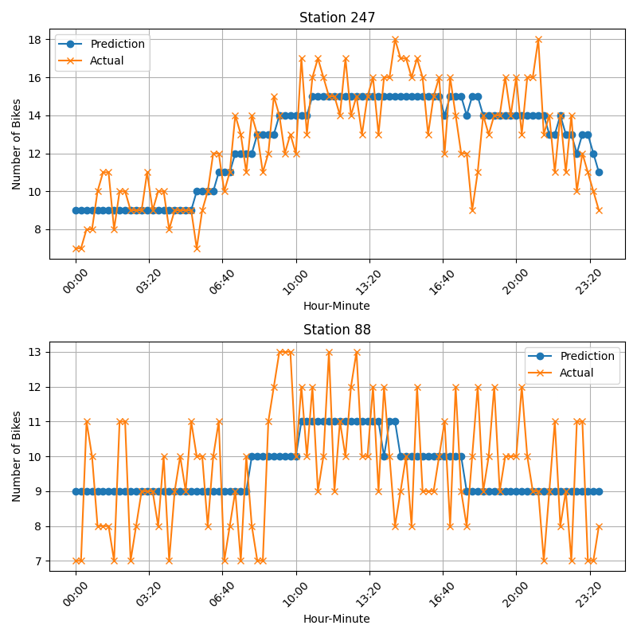
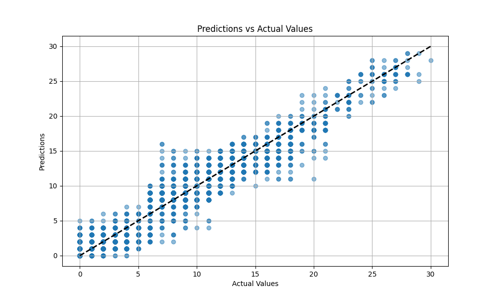
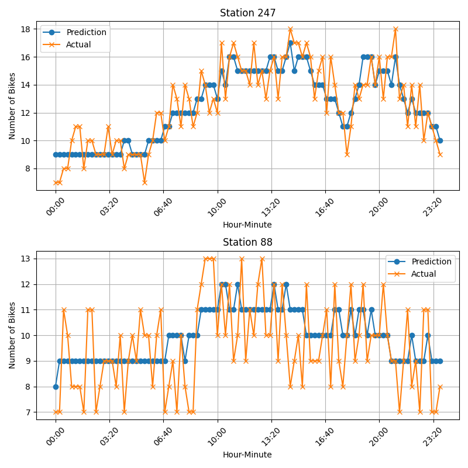
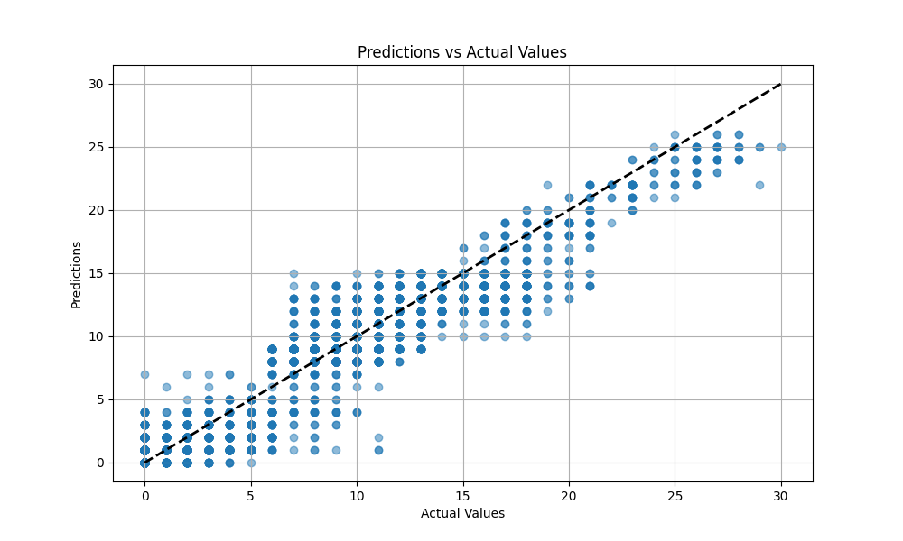

# Sevici : Predicción del estado de estaciones Sevici
**ENGLISH VERSION BELOW**

##  Descripción del proyecto

¿Habrá bicicletas en esta estación mañana temprano? ¿Podré aparcar la bicicleta cerca del trabajo? Conocer la disponibilidad de bicicletas y aparcamientos del servicio Sevici puede ser de gran ayuda a la hora de decidir qué medio de transporte utilizar.

A partir de esta idea surge este proyecto: Poner a disposición de los usuarios un servicio de predicción del estado de las estaciones Sevici, usando modelos de machine learning, a partir de datos reales de utilización del servicio.

## Generación de la base de datos

Para poder desarrollar un modelo de machine learning capaz de predecir el estado de las estaciones Sevici, es necesario tener una base de datos que incluya esta información en el pasado. La API pública de JCDecaux permite obtener el estado de las estaciones en tiempo real, pero no ofrecen los datos históricos. Tras un intento sin éxito de comunicación con la empresa para tener acceso a estos datos, se opta por generar la base de datos usando los datos en tiempo real.

Así, se decidió crear un sistema automático de recopilación de los datos en tiempo real. Durante tres días y cada 10 minutos, se guardaría el estado actual de todas las estaciones en la base de datos. Los tres días seleccionados son los más representativos posible : 
- Jueves : Día laboral entre semana.
- Viernes : Día laboral, fin de semana.
- Sábado : Día no laboral.

Como es lógico, la limitación a 3 días impide utilizar el modelo de ML generado en la práctica. Para tener un buen modelo, haría falta recopilar datos durante muchos más días, para tener en cuenta factores como el clima, los festivos, las vacaciones... Sin embargo, para que el proyecto sea realizable en un plazo razonable, se ha decidido limitar la recopilación de datos reales a estos 3 días, y generar el resto de datos de forma artificial siguiendo argumentos lógicos.

### Obtención de los datos reales

Para obtener los datos reales cada 10 minutos durante tres días, se desarrolló un script Python (`create_db_from_api.py`) que interroga la API de JCDecaux e introduce los datos recibidos en una base de datos PostgreSQL. Para ejecutar periódicamente el script de Python, se creó una nueva entrada en la tabla **crontab**, que permite programar tareas en Linux (y MacOS). 

### Generación de datos sintéticos

Para generar los datos de 1 mes entero se han usado las siguientes suposiciones:
- Una temperatura inferior o superior a 10 y 25 grados, respectivamente, reduce el uso un 50%. El uso se mide como el número de stands disponibles para dejar las bicicletas: Si mucha gente utiliza el servicio, habrá pocas bicicletas disponibles y por lo tanto más espacios disponibles. Esto es una simplificación que tampoco tiene en cuenta que los trayectos pueden ser muchos pero muy cortos y que por lo tanto no impacte tanto en la disponibilidad de bicicletas.
- La lluvia reduce el uso un 80%.
- Un día festivo reduce el uso un 30%.
- Un día de viento fuerte reduce el uso un 50%.
- Un día de huelga en medios de transporte públicos aumenta el uso un 50%.

Estos factores se calculan para un día completo. No es realista ya que la temperatura, por ejemplo, varía según la hora del día, al igual que otros factores como la lluvia. En una aplicación real, estas medidas serían tomadas de fuentes externas y estarían ajustadas según el momento del día.
También se incluye un ruido aleatorio a los datos para dificultar el aprendizaje de los modelos.

## Entrenamiento de los modelos de ML
En la carpeta `prediction` se encuentra el archivo `training.py`. Este archivo permite elegir entre un modelo CatBoostRegressor o un modelo personalizado de red neuronal MLP. 

- CatBoostRegressor : Modelo basado en gradient boosting sobre árboles de decisión. No necesita apenas preprocesamiento de los datos. Captura fácilmente relaciones no lineales y combinaciones entre variables.
- MLP : Implementada en PyTorch. Arquitectura configurable con capas ocultas, dropout y normalización. Requiere normalizar los datos.

### Resultados obtenidos

Para evaluar los modelos, se separa el último día y otros puntos aleatorios de la base de datos antes del entrenamiento. Con estos puntos aleatorios se genera el set de test, con el que se puede estimar el rendimiento del modelo. Con los datos del último día se puede realizar una predicción de un día completo y realizar gráficas para visualizar mejor los resultados.

- Modelo CatBoostRegressor:
    - Gráfica XY con set de test:
    
    En esta gráfica, cuánto más cerca estén los puntos del eje diagonal, mejor son las predicciones. Puede verse que el modelo es capaz de aprender y los resultados siguen claramente la tendencia de la diagonal.
    - Gráfica temporal del último día:
    
    En esta gráfica se puede ver cómo el modelo es capaz de aprender los valores medios del número de bicicletas disponibles en cada estacion según la hora del día. Al tener un ruido aleatorio en los datos, aprender los valores medios es lo mejor a lo que se puede aspirar.

- Modelo MLP : 
    - Gráfica XY con set de test:
    
    Al igual que para el modelo Catboost, la red MLP es capaz de seguir la tendencia de la diagonal.
    - Gráfica temporal del último día:
    
    De nuevo, el modelo es capaz de aprender los valores medios según la estación y la hora del día.

Como es de esperar, y dado que la base de datos ha sido en gran parte generada de forma sintética con conceptos muy simplificados, los modelos pueden aprender bien sobre los datos sin mucha complicación ni recurrir a técnicas cómo data augmentation, feature engineering o modelos neuronales más complejos.

## Estructura de archivos

- `main.py`: Por ahora sin utilizar, contendrá el servidor que dará acceso al modelo de predicción.
- **create_db** : Esta carpeta contiene los scripts necesarios para obtener la base de datos desde la API de JCDecaux y para aumentarla de forma sintética.
    - `generate_db.py` : Es el archivo principal para aumentar la base de datos de forma sintética.
    - `create_db_from_api.py` : Es el archivo que se debe llamar periódicamente para incorporar los datos desde la API de JCDecaux a la base de datos PostgreSQL.
- **prediction** : Esta carpeta contiene el código para entrenar los modelos. También contiene las carpetas de imágenes y modelos donde se almacenan los resultados del entrenamiento.
    - `training.py`: Es el archivo principal que se debe ejecutar para lanzar el entrenamiento de un modelo. Las definiciones iniciales permiten elegir entre el modelo CatBoost o el modelo MLP (nn: neural network), así como alterar algunos parámetros de configuración.

## Estado del proyecto
En desarrollo. Próxima versión con servidor para dar acceso a las predicciones de los modelos.

### _NOTA IMPORTANTE_ 
No se trata de una aplicación en producción ni de un sistema completo funcional.
Su objetivo principal es servir como ejemplo técnico dentro de un portafolio personal, mostrando el uso de herramientas como Python, PostgreSQL, APIs públicas, visualización de datos, y conceptos de Machine Learning.

El foco del proyecto está en la integración tecnológica, no en la explotación final de los resultados. Además, la augmentación de la base de datos real mediante técnicas de generación de datos sintéticas muy simplificadas no permite tener un modelo que dé buenos resultados en una aplicación real.

---
**ENGLISH VERSION**

# Sevici: Predicting the Status of Sevici Stations

## Project Description

Will there be bikes available at this station tomorrow morning? Will I be able to park my bike near work? Knowing the availability of bikes and parking spaces in the Sevici bike-sharing system can be very helpful when deciding which means of transport to use.

This idea inspired the project: to provide users with a prediction service for the status of Sevici stations using machine learning models and real usage data from the service.

## Database Generation

To build a machine learning model capable of predicting the status of Sevici stations, a historical database is needed. The JCDecaux public API provides real-time status updates for the stations, but it does not offer historical data. After an unsuccessful attempt to contact the company for access to this data, the decision was made to create the database using real-time data collection.

An automatic system was developed to collect real-time station data every 10 minutes over three days. These three days were chosen to be as representative as possible:
- **Thursday**: A regular weekday.
- **Friday**: A weekday that transitions into the weekend.
- **Saturday**: A weekend day.

Naturally, limiting the dataset to just three days is not sufficient to train a robust machine learning model. A more effective model would require data collected over a longer period, accounting for factors such as weather, holidays, and vacations. However, to keep the project feasible within a reasonable timeframe, the data collection was limited to these three days, and additional data was generated artificially using logical assumptions.

### Collecting Real Data

To collect real data every 10 minutes over three days, a Python script (`create_db_from_api.py`) was developed. This script queries the JCDecaux API and stores the data in a PostgreSQL database. To execute the script periodically, a new entry was added to the **crontab**, which allows scheduled tasks on Linux (and macOS).

### Synthetic Data Generation

To simulate data for a full month, the following assumptions were made:
- Temperatures below 10°C or above 25°C reduce usage by 50%. Usage is estimated by the number of available stands to drop off bikes: the fewer bikes available, the higher the usage. This is a simplification that doesn't consider short trips or turnover rates.
- Rain reduces usage by 80%.
- Public holidays reduce usage by 30%.
- Strong wind reduces usage by 50%.
- A public transport strike increases usage by 50%.

These factors are applied to full days. While not realistic—since weather conditions change throughout the day—in a real-world application, such data would be taken from external sources and adjusted by time of day. Random noise was also added to the dataset to make the learning task more challenging.

## Training the ML Models

The `prediction` folder contains the `training.py` file, which allows choosing between a **CatBoostRegressor** model and a custom **MLP neural network**.

- **CatBoostRegressor**: A gradient boosting model using decision trees. It requires little preprocessing and easily captures non-linear relationships and variable interactions.
- **MLP**: Implemented in PyTorch, with a configurable architecture including hidden layers, dropout, and normalization. Data must be normalized before training.

### Results

To evaluate the models, the last day and a random selection of data points were separated from the database before training. These random points make up the **test set**, used to estimate model performance. The last day's data is used to predict a full day and to generate visualizations.

- **CatBoostRegressor**:
    - XY Plot with test set:  
      
    In this plot, the closer the points are to the diagonal, the better the predictions. The model clearly learns the underlying trend.
    - Time series plot of the last day:  
      
    The model successfully learns the average number of available bikes at each station throughout the day. Since the data includes random noise, learning these average values is the best achievable outcome.

- **MLP Model**:
    - XY Plot with test set:  
      
    Like the CatBoost model, the MLP follows the diagonal trend well.
    - Time series plot of the last day:  
      
    Again, the model captures the average values based on the station and time of day.

As expected, given that the database was largely generated synthetically using simplified concepts, both models are able to learn well from the data without the need for advanced techniques such as data augmentation, feature engineering, or deeper neural architectures.

## File Structure

- `main.py`: Not yet used. It will eventually run a server to expose the prediction model.
- **create_db**: Contains scripts for retrieving and augmenting the database from the JCDecaux API.
    - `generate_db.py`: Main script for generating synthetic data.
    - `create_db_from_api.py`: Script to be run periodically to add real-time data from the JCDecaux API into the PostgreSQL database.
- **prediction**: Contains training code, along with folders for storing model outputs and result images.
    - `training.py`: Main training script. It allows switching between CatBoost and MLP models and tuning some configuration parameters.

## Project Status

In development. Next version will include a server to provide access to model predictions.

### _IMPORTANT NOTE_

This is **not** a production-ready application or a fully functional system.  
Its main goal is to serve as a **technical showcase** in a personal portfolio, demonstrating the use of tools such as Python, PostgreSQL, public APIs, data visualization, and machine learning concepts.

The focus of the project is on **technical integration**, not on final exploitation of the results. Moreover, the use of simplistic synthetic data generation techniques limits the model's effectiveness in a real-world application.
